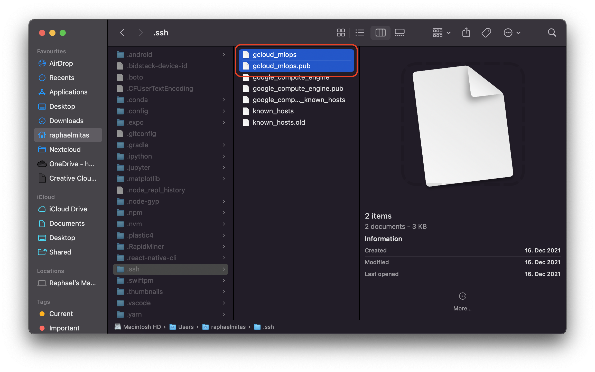

# Use Pycharm for Jupyter Notebooks in an GCP Instance

Sometimes it is necessary to use a VM in the cloud to process data. Jupyter Notebook is a very good tool to accomplish a
lot of that. But the Browser Version offers no code completion. Thats why I have turned to Pycharm.
Turned out it is not that easy to configure. Here is how I did it...


First if gcp isn't configured to use a static ip address, you can do so like described 
[here](https://cloud.google.com/compute/docs/ip-addresses/reserve-static-external-ip-address). 

Now type the following command to generate a new ssh key pair on your Mac terminal:
`ssh-keygen -t rsa -f ~/.ssh/gcloud_mlops` you can replace `gcloud_mlops` with anything you like.

Navigate to your `.ssh/` folder. If it doesn't appear in your finder home folder press `cmd + shift + .` 
to reveal hidden folders.


there should be two files in there `gcloud_mlops` for your private key and `gcloud_mlops.pub` for your public key:



now open the `gcloud_mlops.pub` file in textedit or any similar program and copy the content


1. navigate to your VM instances on GCP
2. click on the name of your chosen instance
3. click on `EDIT`
4. scroll to `SSH Keys` and click on `Show and edit`
5. now click on `Add item` to add a new ssh public key 
6. finally paste your previously copied public key and click `Save`

You have added your public key to the gcp instance. Next we need to connect pycharm to the VM.

## Connecting pycharm to a GCP VM

First we will need to configure our ssh connection with the VM.
Go to Pycharm --> Preferences --> Tools --> SSH Configurations.
It should look something like this:


- enter your static VM instance ip
- enter your username
- as Authentication type select `Key pair`
- direct the `private key file` to our previously created ssh private key 
- click `Test Connection` to test if everything works
- click `Apply`

Now we want to configure the remote python interpreter.
For that open PyCharm --> Preferences --> Project --> Python interpreter --> Options wheel --> add --> SSH Interpreter


Select `Existing server configuration` and then the configuration we just made.
Click Next then point the path to your remote python location, click Finish.


## Starting the remote notebook

To start a remote notebook...
Go to your VM Instance click on the little arrow besides `SSH` --> click on `View gcloud command`, copy the content.
Now go to your terminal (this can be the one in pycharm or from the operating system). Paste the command in 
and append `--ssh-flag="-L 8888:localhost:8888"`. This will assure that you can use the notebook from your notebook locally.
```
gcloud beta compute ssh --zone "SOME ZONE" "SOME VM"  --project "SOME PROJECT" --ssh-flag="-L 8888:localhost:8888" 
```

go to your project folder through the terminal and type `jupyter notebook`

```
cd project/
jupyter notebook
```

now your remote notebook should have started. You can access it through your browser with the URL:
[http://localhost:8888](http://localhost:8888). But we don't want to do that since we want to work out of Pycharm.

- Go to that top of your Jupyter Notebook file in pycharm and select `Configure Jupyter Server` like shown in the picture below.


- now select `Configured Server:` and type in  `http://localhost:8888`


- now click apply and you're done

Quick Tipp if you don't want to sync your files to your gcp instance...
Go to Tools --> Deployment and untick Automatic Deployment

